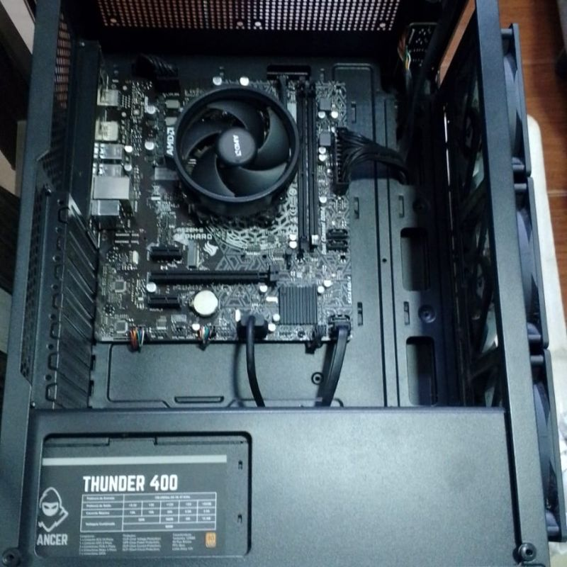
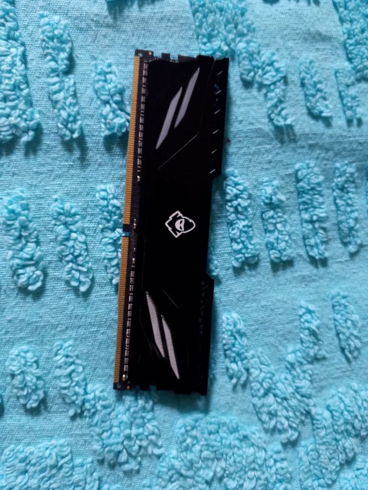

# Limpeza básica no meu hardware

Sabe quando a teoria precisa dar espaço para a prática? Pois é. Decidi pausar um pouco os meus estudos diários de software para resolver um problema que já estava me incomodando há um tempo: o acúmulo de poeira no meu computador. 

Mais do que apenas limpar, encarei esse momento como uma oportunidade para abrir o gabinete, perder o medo e entender de verdade como os meus componentes conversam entre si no mundo real.

---

## 🔍 O Ponto de Partida (E o incômodo com a poeira)

O principal motivo de eu ter parado tudo para essa manutenção foi o estado dos meus fans frontais. Como dá para ver na foto abaixo, a poeira já estava acumulada nas pás, o que com certeza estava sufocando o fluxo de ar e esquentando os componentes internos.

---

## Abrindo o Gabinete e Explorando o Hardware

Coloquei o PC na bancada, deitei o gabinete com cuidado e tirei a tampa lateral. Foi muito maneiro olhar para a placa-mãe, identificar o Air Cooler da CPU, ver a distribuição dos cabos da fonte e mapear mentalmente o caminho que o ar faz ali dentro.

 
Para ir um pouco além da limpeza superficial, removi as memórias RAM para entender melhor os componentes e como funciona seu encaixe.  

---

## Foram 5 Horas de Desafios (E o que eu aprendi com eles)

No total foram cerca de **5 horas** nesse processo. No meio do caminho, nem tudo saiu como planejado:

* **Tentativa de remover os fans:** Eu queria muito ter tirado os fans frontais para limpar cada pá com perfeição fora do gabinete. Peguei as chaves de fenda, tentei de verdade, mas os parafusos estavam muito firmes e estava difícil o manuseio da chave por conta da placa-mãe estar muito emcima e o parafuso do fan muito baixo, e preferi não forçar para não danificar nada.
* **A solução:** Contornei a situação limpando com paciência diretamente no local, garantindo que as vias de ar ficassem desobstruídas.
* **O valor da experiência:** Pode não ter sido uma desmontagem avançada de nível profissional (com troca de pasta térmica ou lavagem química), mas o contato direto com o hardware me deu uma bagagem prática enorme e muito mais confiança para as próximas manutenções.

---

## Resultado Final

No fim, todo o esforço valeu a pena. O computador não só ficou com uma aparência renovada e muito mais bonita na mesa, como também passou a rodar de forma mais silenciosa e refrigerada, o que faz toda a diferença na hora de focar nos estudos.

---

### 🧠 Lição que fica:
A tecnologia acontece no software, mas roda no hardware. Entender o ambiente físico onde nossos sistemas operam é fundamental para ser um profissional de TI completo. Se você tem medo de abrir seu PC, recomendo começar devagar, documentar o processo e aprender com cada parafuso!
